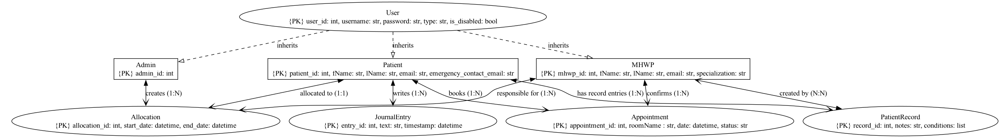

# Serenify Project Notes

[Todd's diagram of overall structure](https://lucid.app/lucidspark/0daace95-f237-4da9-b69d-43f0215e82d1/edit?invitationId=inv_7aa9b477-44f2-47d7-93aa-e2f762b3ea6f&page=0_0#)

[Aleksandra's task allocation plan](task_allocation.pdf)

# Set-up
## Front End
<!-- tkinter is a standalone library within Python so does not require terminal commands -->
### Please check out the 2 comments on watch_tkinter.py, you may need to make slight changes depending on what you're working on

<!-- Download watchdog so that you have an automatically live preview to show you how your work looks for the user on the frontend. -->

### Do:

pip install watchdog

### If that doesnt work:

pip3 install watchdog
 

## Back End
Entity relationship diagram

### Interacting with the data system
Please refer to database/database_demo.py for a demo on how to interact with the data system.

