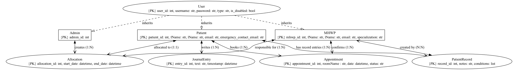

# introProgrammingProject
# Set-up
## Front End
<!-- tkinter is a standalone library within Python so does not require terminal commands -->
### Please check out the 2 comments on watch_tkinter.py, you may need to make slight changes depending on what you're working on

<!-- Download watchdog so that you have an automatically live preview to show you how your work looks for the user on the frontend. -->

### Do:

pip install watchdog

### If that doesnt work:

pip3 install watchdog
 

## Back End
Entity relationship diagram
